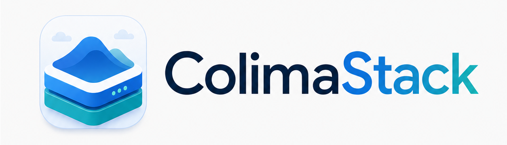

<p align="center">
  
</p>

<p align="center">
  A native macOS control center for Colima profiles, Docker resources, and Kubernetes development clusters.
</p>

ColimaStack gives [Colima](https://github.com/abiosoft/colima) a focused graphical workspace for local container development. It helps you inspect runtime health, manage profiles, browse Docker inventory, view Kubernetes resources, and diagnose toolchain issues without hiding the command-line tools doing the work.

> [!NOTE]
> ColimaStack is not a container engine. It controls and inspects local tools such as `colima`, `docker`, `kubectl`, and `limactl`.

## Features

- **Profile management**: create, edit, start, stop, restart, update, and delete Colima profiles.
- **Runtime overview**: view profile state, Docker context, socket, address, resources, Kubernetes status, recent activity, and logs.
- **Docker inventory**: browse containers, images, volumes, networks, runtime stats, and Docker disk usage.
- **Kubernetes visibility**: inspect nodes, namespaces, pods, deployments, services, and metrics when Kubernetes is enabled.
- **Diagnostics**: check `colima`, `docker`, `kubectl`, `limactl`, Docker context, and Kubernetes context health.
- **Command transparency**: review active operations, command history, stdout, stderr, and Colima daemon logs.
- **Menu bar access**: check runtime state and jump back into the main workspace from the macOS menu bar.

## Requirements

- macOS 14 or later
- Xcode for local development
- Homebrew-managed CLI dependencies:

```sh
brew install colima docker kubectl lima
```

## Quick Start

From the repository root, install the local toolchain, then open the Xcode project:

```sh
open ColimaStack.xcodeproj
```

Run the `ColimaStack` scheme from Xcode, or build it from Terminal:

```sh
xcodebuild -project ColimaStack.xcodeproj -scheme ColimaStack build
```

To verify Colima separately before launching the app:

```sh
colima start
docker context use colima
docker ps
```

For named profiles, Docker contexts usually follow the `colima-<profile>` pattern.

## Documentation

The documentation site is built with Astro Starlight and lives in [`docs`](docs).

```sh
cd docs
pnpm install
pnpm dev
```

Useful docs entry points:

- [Quick Start](docs/src/content/docs/quick-start.md)
- [Install](docs/src/content/docs/install.md)
- [Architecture](docs/src/content/docs/architecture.md)
- [Command API](docs/src/content/docs/reference/command-api.md)

## Development

Project structure:

```txt
ColimaStack/          SwiftUI macOS app
ColimaStackTests/     Unit tests
ColimaStackUITests/   UI tests
docs/                 Astro Starlight documentation
design/               Product and screen notes
```

Run tests with:

```sh
xcodebuild test -project ColimaStack.xcodeproj -scheme ColimaStack
```

Build the docs with:

```sh
cd docs
pnpm build
```

## Releases

App CI runs from [`.github/workflows/app-release.yml`](.github/workflows/app-release.yml). Pull requests and pushes to `main` run unit tests, build the macOS app, then upload the packaged `.app` zip as a workflow artifact.

Release builds publish the same zip and its SHA-256 checksum to a GitHub Release. Create a release by pushing a version tag:

```sh
git tag v0.0.1
git push origin v0.0.1
```

You can also run the workflow manually from GitHub Actions and provide a `x.y.z` version number. The app version comes from `MARKETING_VERSION`, which starts at `0.0.1`; CI uses the GitHub Actions run number as `CURRENT_PROJECT_VERSION` unless a manual numeric build number is supplied. The GitHub-built artifact is unsigned until Developer ID signing secrets are added to the workflow.

## How It Works

ColimaStack is a local-first macOS app. It calls the Colima CLI for profile lifecycle operations, uses Docker CLI JSON output for runtime inventory, reads Kubernetes state through `kubectl`, and loads selected Colima files such as profile configuration, SSH config, and daemon logs.

Most profile-scoped operations use the `COLIMA_PROFILE` environment variable so the active app selection maps directly to the intended Colima runtime.

## Current Scope

This repository contains the macOS app, tests, and documentation for the current launch surface. Some documented workflows still require final smoke testing against a live Colima installation before release.
